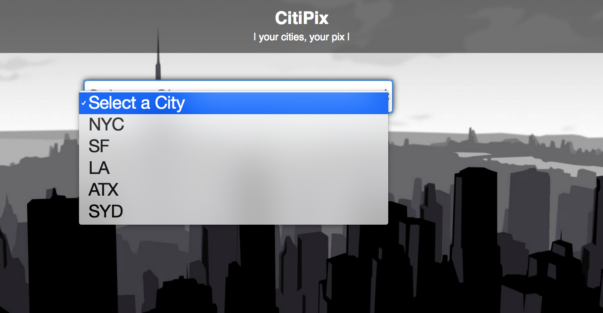

#FEWD Week # 6: Working with Arrays

---


###Description 


The team from CitiPix has reached out for iteration on their prototype.  Instead of using a user's text input to change the background of the interface, the CitiPix user experience designers have asked to see how a drop-down menu would work in place of an input field.  The product managers are hopeful it will also lead to less error handling for their engineers and data team.  Use what you've learned this week about data-types and arrays and use the starter code - or your code from last week - and make the adjustments to your JavaScript file. Be sure to start out with Pseudocode. 

<br>

---


###Real-World Applications


- Use data stored in an array to manipulate the DOM 
- Write pseudocode before writing any JavaScript, in order to demonstrate an understanding of interactive programming theory
- Revisit applications and code you've written in the past to find solutions to problems you've already solved and iterate on a project 

<br>

---


###Technical Requirements 

- Create an array with the following values: "NYC", "SF", "LA", "ATX", "SYD"; use the array to add values to the ```<select>``` menu by using a ```for``` loop in JavaScript (don't update the HTML to do this!)
- When the user changes the input of the drop-down, update the background image based on what they selected
- Use .createElement() and appendChild() in your iteration on the drop-down menu 
- Use the `.setAttribute()` method to update html classes 
- Use the 'change' event handler to capture user actions
- Use ```if/else if/else ``` conditionals to control the flow of your application
- Display your pseudocode as Javascript comments

####Bonus

- [Read](http://bavotasan.com/2011/style-select-box-using-only-css/) [up](https://css-tricks.com/dropdown-default-styling/) on your own and incorporate some more styles on the drop down menu
- While the dropdown menu should update the page in the same way it did after your work last week, take a look at what your final product should look like with a dropdown menu:





<br>

---

###Resources


- [W3Schools: Working with Arrays in JavaScript](http://www.w3schools.com/js/js_arrays.asp)
- [MDN: Arrays](https://developer.mozilla.org/en-US/docs/Web/JavaScript/Reference/Global_Objects/Array)
- [W3Schools: Loops in JavaScript](http://www.w3schools.com/js/js_loop_for.asp)
- [W3Schools: Appending HTML elements using JavaScript](http://www.w3schools.com/jquery/html_append.asp)
- [Kirupa.com: Looping in JavaScript](http://www.kirupa.com/html5/loops_in_javascript.htm)

Read ahead [about responsive design for next week](http://www.smashingmagazine.com/2011/01/12/guidelines-for-responsive-web-design/)


<br>

---

###Evaluation / Submission


Students should use the same folder and GitHub repository as the previous project ("homework-city"). When ready for evaluation they should push their code to that repository. Instructional team should evaluate against the solution code and the student's use of technical elements. They will provide a numeric grade on a scale: does not meet expectations (0); meets expectations (1); exceeds expectations (2).  The maximum possible score on this assignment is 16/16. Bonus materials are completely optional.


